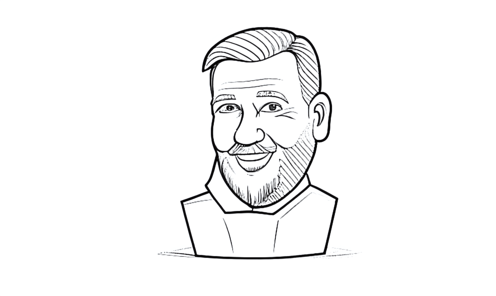

# AI Sketch Booth

An AI-powered photobooth that turns your selfies into caricatures and physically draws them with a robotic arm!

[](https://www.tiktok.com/@erwinried/video/7562942852385230083)

## Demo

Watch it in action:

https://www.tiktok.com/@erwinried/video/7562942852385230083

### Example Output

<div align="center">
  
  <p><em>AI-generated caricature ready for robotic drawing</em></p>
</div>

## Features

- **Live Camera Feed**: Real-time video preview with 3-2-1 countdown
- **AI Caricature Generation**: Powered by ComfyUI for artistic transformations
- **Robotic Drawing**: DexArm plotter physically draws the caricatures
- **Creative Prompts**: 200+ fun scenario suggestions (e.g., "with a robot dog", "on the beach", "taking a taxi")
- **SVG Optimization**: Multiple drawing methods optimized for plotting
- **Real-time Progress**: Live drawing progress with time estimates
- **Web-based Setup**: Interactive calibration wizard for robot arm
- **Fullscreen/Kiosk Mode**: Perfect for events and installations
- **Auto-Save**: Photos, caricatures, and SVGs saved with timestamps

## Quick Start (Windows)

**Easiest method:**
1. Double-click `launch.bat`
2. The script will automatically:
   - Install dependencies if needed
   - Start the Flask server
   - Open Chrome with proper camera permissions
   - Launch the photobooth

## Manual Installation

1. Install Python dependencies:
```bash
pip install -r requirements.txt
```

## Manual Usage

1. Start the server:
```bash
python app.py
```

2. Open Chrome with camera permissions:
```bash
chrome.exe --new-window --app=http://localhost:5000 --use-fake-ui-for-media-stream
```

3. Or open your browser to: `http://localhost:5000` (you'll need to allow camera access)

## How to Use the Photobooth

1. **Allow camera access** when prompted by your browser
2. **Browse suggestions** - 20 random creative scenarios are displayed
3. **Click a suggestion** to fill the prompt textbox, or type your own scenario
4. **Click "Take Photo"** to capture your image with a flash effect
5. **Enter Fullscreen Mode** for a kiosk experience (button hides in fullscreen, press ESC to exit)

## How It Works

1. **Capture**: WebRTC camera captures your photo with a countdown
2. **AI Processing**: ComfyUI generates an artistic caricature from your photo
3. **Vectorization**: Image is converted to optimized SVG paths for plotting
4. **Robotic Drawing**: DexArm physically draws the caricature with a pen
5. **Real-time Feedback**: Watch the progress with time estimates

### Tech Stack

- **Backend**: Flask (Python)
- **Frontend**: Vanilla JavaScript + WebRTC
- **AI**: ComfyUI with ControlNet for line art generation
- **Hardware**: DexArm robotic plotter
- **Vector Processing**: Potrace for SVG conversion with custom optimizations

## File Structure

```
ai-sketch-booth-claude/
├── app.py                       # Main Flask server
├── launch.bat                   # Windows launcher script
├── requirements.txt             # Python dependencies
├── suggestions.json             # 200+ creative prompt suggestions
│
├── comfyui_client.py           # ComfyUI API integration
├── dexarm_controller.py        # DexArm robot control
├── svg_converter.py            # Image to SVG conversion
├── svg_parser.py               # SVG path parsing for plotting
├── svg_plotter_methods.py      # Alternative SVG optimization methods
├── svg_thick_joining_variations.py  # Line joining strategies
├── svg_clean_centerline.py     # Centerline extraction
│
├── templates/
│   ├── index.html              # Main photobooth interface
│   ├── setup.html              # DexArm calibration wizard
│   └── settings.html           # App configuration
│
├── static/
│   ├── style.css               # Main styles with animations
│   ├── app.js                  # Photobooth logic
│   ├── setup.js                # Calibration UI
│   └── settings.js             # Settings management
│
├── workflows/                  # ComfyUI workflow definitions
├── photos/                     # Captured photos
├── caricatures/                # AI-generated caricatures
└── svgs/                       # Vector drawings for plotting
```

## Setup Requirements

### Hardware
- DexArm robotic plotter (optional, app works without it)
- Webcam or built-in camera

### Software
- Python 3.8+
- ComfyUI server (optional, for AI caricature generation)
- Potrace (for SVG conversion)

See [POTRACE_INSTALL.md](POTRACE_INSTALL.md) for Potrace installation instructions.

## Configuration

- Visit `/setup` to calibrate the DexArm robot arm
- Visit `/settings` to configure:
  - ComfyUI server URL
  - SVG optimization method
  - Pen lift height
  - Maximum drawing commands

## Future Enhancements

- Multiple art styles (cartoon, sketch, anime, etc.)
- QR code generation for instant sharing
- Email/SMS photo delivery
- Social media integration
- Custom branding options
- Multi-language support

## Browser Compatibility

Requires a modern browser with WebRTC support:
- Chrome 53+
- Firefox 36+
- Safari 11+
- Edge 79+

## Notes

- **Camera access on Chrome**: The `launch.bat` script automatically opens Chrome with flags to bypass camera permission issues on localhost
- **Fullscreen mode**: The fullscreen button automatically hides when in fullscreen - use ESC key to exit
- **Suggestions**: 20 random suggestions are displayed at a time and refresh when you click one
- **Custom prompts**: You can type your own scenario in the textbox instead of using suggestions
- **Drawing optimization**: Multiple SVG methods available - see [PLOTTER_METHODS_EXPLAINED.md](PLOTTER_METHODS_EXPLAINED.md) and [SVG_VERSIONS_EXPLAINED.md](SVG_VERSIONS_EXPLAINED.md)
- **Progressive enhancement**: App works without ComfyUI (manual uploads) and without DexArm (SVG export only)

## Credits

Built with [Claude Code](https://claude.com/claude-code) by [@erwinried](https://tiktok.com/@erwinried)

## License

MIT
